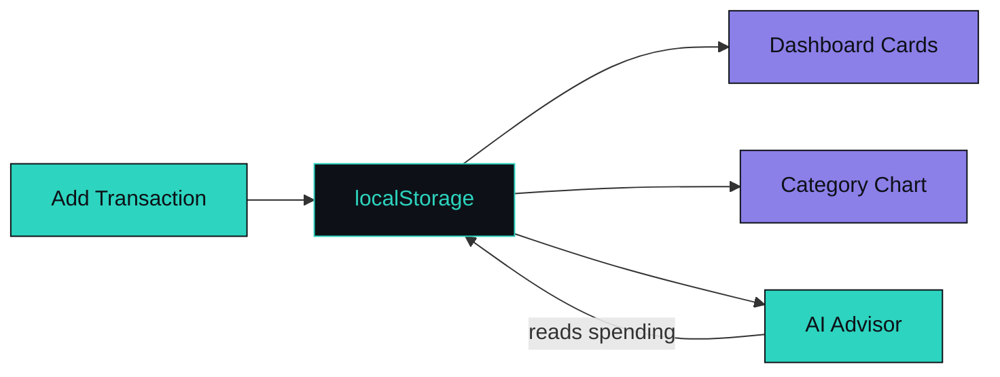

<div align="center">


<br/>


</div>

## What this is

A finance tracker built as one self-contained HTML file, tuned to how a university student actually spends money — hall dining, transport fares, printouts, mobile recharge, and a few categories most trackers pretend don't exist.

No sign-up, no server, no dependencies to install. Open the file, and it works. Everything is saved to `localStorage` in the browser.

<div align="center">

</div>

## Features

**Tracking**
- Add, edit, and delete income and expense entries
- 17 built-in categories, each with its own monthly budget ceiling
- Category filtering across the transaction list
- Live spending-by-category bar chart, animated on render

**Dashboard**
- Current balance, total spent, and saved/remaining at a glance
- Dedicated cards for smoking spend, relationship expenses, and betting profit/loss
- Sidebar budget overview with per-category progress bars

**Built-in helpers**
- Cigarette budget calculator with real market prices and combo suggestions
- Preset bundles for common date/outing expenses
- Betting tracker that logs profit and loss as separate entries so the balance stays honest

**AI panel**
- A built-in budget advisor personality in the sidebar
- Quick-prompt buttons for common situations ("out of money," "won on a bet")
- Responds with context-aware feedback and saving tips based on actual spending data

<div align="center">



</div>

## Run it

There's nothing to install.

```bash
git clone https://github.com/pbs002-s/student-finance-tracker.git
cd student-finance-tracker
open index.html   # or just double-click it
```

## Deploy on GitHub Pages

1. Repo → **Settings** → **Pages**
2. Source: `Deploy from a branch`, branch `main`, folder `/ (root)`
3. Save — it's live in about a minute

## Stack

Vanilla HTML, CSS, and JavaScript. No frameworks, no bundler, no npm install. `localStorage` handles persistence.

## Project structure

```
student-finance-tracker/
├── index.html
└── README.md
```

---

<div align="center">


Built by [**@pbs002-s**](https://github.com/pbs002-s)


</div>
